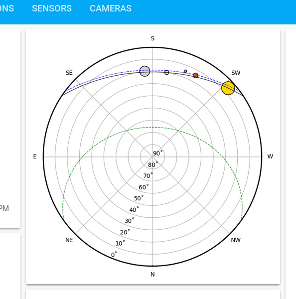

# Live Sun, Moon, and Planets for Home Assistant

[](https://github.com/partofthething/ha_skyfield)

This is a custom component for [Home Assistant ](https://www.home-assistant.io/) 
that makes a live polar sun path chart for your location. Besides the Sun, it
also shows the Moon and a few major planets. Plus, it shows the Winter and Summer solstice sun paths so you can see where you are in the seasons!



This uses the [skyfield library](https://rhodesmill.org/skyfield/) to do the computations. 

To use: 

* Install this in your `custom_components` folder
* Download the prerequisites: `pip3 install skyfield matplotlib numpy` (no longer
  necessary with hassio!)
* Add the following to your home assistant config:
```yaml
camera:
    platform: ha_skyfield
```
* Add a picture entity to your GUI with this camera. It will update live.

Optional configuration:

* `show_time` add a timestamp to the plot
* `show_legend` add a legend of the bodies
* `show_constellations` enable or disable the constellations (default is True).
* `planet_list` customize which planets are shown
* `constellations_list` customize which constellations are shown

Known Issues:

* WARNING: High CPU usage! The underlying library is relatively long-running. Disable or
  limit constellations if you're using a smaller computer, like a Raspberry Pi. Even with
  them off, the CPU load may unacceptable. Options and more 
  discussion in [#4](https://github.com/partofthething/ha_skyfield/issues/4)

* Does not follow Theme because of matplotlib backend (see
  [#5](https://github.com/partofthething/ha_skyfield/issues/4)

* More (maybe) at [Issues](https://github.com/partofthething/ha_skyfield/issues)

Inspiration comes from the University of Oregon 
[Solar Radiation Monitoring Lab](http://solardat.uoregon.edu/PolarSunChartProgram.html).


