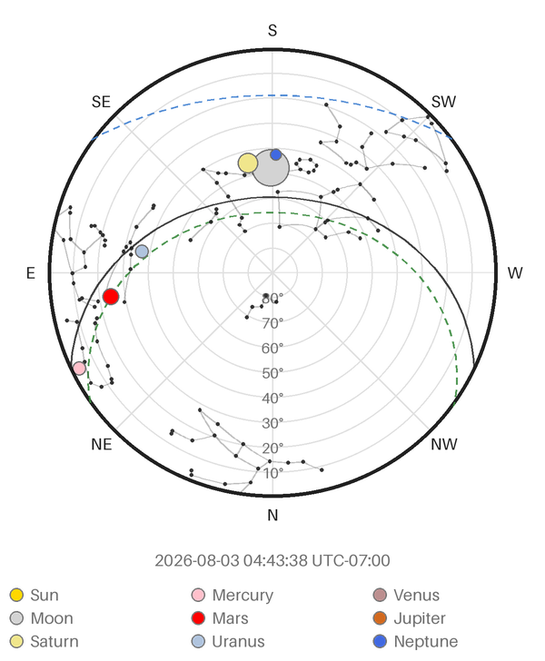
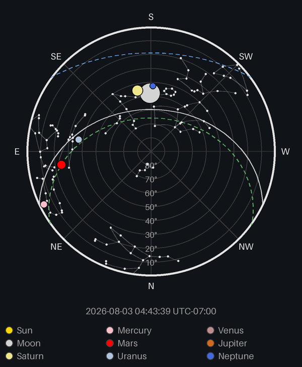

# Live Sun, Moon, and Planets

[](https://github.com/partofthething/ha_skyfield)

A live polar sun path chart for your location. Besides the Sun, it also shows the Moon and
a few major planets. Plus, it shows the Winter and Summer solstice sun paths and the
current path so you can see where you are in the seasons! It's a super interesting chart
because all at once it gives you an indication of the season, the time, and the sun
position, which, if you think about it, helps you orient yourself directionally just based
on observing the sun.

| | |
|---|---|
|  |  |

The card follows your theme, so it draws itself either way.

This uses the [skyfield library](https://rhodesmill.org/skyfield/) to do the computations. 


See [`pebble/README.md`](pebble/README.md) for the watch and
[Standalone](#standalone) below for everything outside Home Assistant.

## To use with Home Assistant

* Install this in your `custom_components` folder (or add the repository to HACS)
  and restart
* Go to **Settings > Devices & Services > Add Integration** and search for
  *HA Skyfield*. Everything has a sensible default, so you can simply accept the
  form; the location starts at your home location.
* Add this card to your dashboard:
```yaml
type: custom:skyfield-card
```

Optional card configuration:

* `title` a heading for the card
* `show_time` show a timestamp under the chart
* `show_legend` show a legend of the bodies
* `show_constellations` draw the constellations
* `north_up` (boolean) puts North at the top (useful in the Southern Hemisphere)
* `horizontal_flip` (boolean) flips projection horizontally
* `refresh_interval` seconds between asking the server for new positions (default 600)
* `redraw_interval` seconds between redraws (default 30)

The settings can be changed in yaml or at any time from the **Configure** button beside
the integration, and the chart is redrawn as soon as you save them.

The card registers itself as a dashboard resource, so there is normally nothing to
add by hand. It draws itself as SVG, so it stays sharp at any size and takes its
colors from your theme, dark mode included.

If your dashboard resources are managed in YAML rather than through the UI, Home
Assistant will not let the integration add to them, and you will see a warning in
the log saying so. Add it yourself in that case:

```yaml
lovelace:
  resources:
    - url: /ha_skyfield/skyfield-card.js
      type: module
```

If a dashboard ever reports `Custom element doesn't exist: skyfield-card`, look in
the browser console for a `skyfield-card loaded` line. If it is absent the file is
not reaching the browser; if it is present the card is loaded and the dashboard
simply asked for it too early, which the resource registration above fixes.

The chart is drawn in your browser from the sky coordinates Home Assistant sends
it. Those only change slowly, so the browser can turn the sky itself as the
minutes pass — it redraws twice a minute and only asks the server for new
positions every ten minutes.


Anything you leave out follows what the integration is configured with. The
solstice path colors can be restyled with the `--skyfield-winter-color` and
`--skyfield-summer-color` theme variables.

### If you already have this configured in YAML

An `ha_skyfield:` block in `configuration.yaml` still works: the first time Home
Assistant starts with this version it is read once and turned into a
configuration you can edit in the UI, keeping every setting it had. After that
the block is no longer read — there is a warning in the log saying so — and it
can be deleted.

The options were, and the ones in the UI are the same:

* `show_constellations` enable or disable the constellations (default is True).
* `show_time` and `show_legend` defaults for the card
* `planet_list` customize which planets are shown
* `constellations_list` customize which constellations are shown (use names from
  [here](https://github.com/partofthething/ha_skyfield/blob/master/custom_components/ha_skyfield/constellations_by_RA_Dec.dat))
* `north_up` (boolean) puts North at the top (useful in the Southern Hemisphere)
* `horizontal_flip` (boolean) flips projection horizontally
* `latitude` and `longitude` if you want somewhere other than your home

## The old image version

If you would rather have an image than a card for backwards compatibility, there is still
a camera entity:

```yaml
camera:
  platform: ha_skyfield
  show_constellations: false
```

Then add a picture entity to your GUI with this camera. It is a YAML platform and
stands on its own — it draws its own sky and needs nothing else set up — so add
the integration as well if you want the card or the endpoints below. It takes the
same options listed above, plus:

* `image_type` `png` (default), `jpg`, or `svg`. A chart is fine lines on flat
  color, which is the worst thing to hand a JPEG, so `png` is the one to use.
* `theme` `light` (default) or `dark`. A picture is painted once and cannot ask
  who is looking at it, so unlike the card it has to be told.
* `width` in pixels, 800 by default. The chart is drawn at that size rather than
  drawn small and stretched.

The integration also serves the chart directly at `/api/ha_skyfield/sky.png` and
`/api/ha_skyfield/sky.svg`, both taking `?theme=` and the picture one `?width=`.
There is a sensor platform too, whose state is the Sun's altitude and which
writes the chart to `www/sun.png` for `/local/sun.png`.

The card is still the better option where you can use it: it turns the sky in
your browser without asking the server, follows your theme, and stays sharp at
any size.

## Standalone

Beyond the home assistant integration, this also includes the following standalone
features:

* a **command line tool and small web server** that write the same chart as an SVG
  file, for a web page or anything else that wants a picture
* a **Pebble watch face**, in [`pebble/`](pebble/)


```console
$ pip install git+https://github.com/partofthething/ha_skyfield
$ skyfield-sky svg --lat 47.608 --lon -122.335 --tz America/Los_Angeles -o sky.svg
```

The first run downloads a 17 MB ephemeris and keeps it in `~/.cache/ha_skyfield`,
so it is only slow once. The SVG is self-contained — one file, no external CSS,
no fonts to fetch — and follows the reader's dark mode unless you pin it with
`--theme light` or `--theme dark`. `--palette` is available from Python if you
want it to match a site's colors.

For a web page, the simplest thing is usually to redraw a file on a timer and let
whatever already serves the site hand it out:

```console
$ skyfield-sky watch --lat 47.608 --lon -122.335 --tz America/Los_Angeles \
      --interval 300 -o /var/www/sky.svg
```

Or run the built-in server, which has no dependencies beyond the ones drawing the
chart already needs:

```console
$ skyfield-sky serve --lat 47.608 --lon -122.335 --tz America/Los_Angeles --port 8099
```

| | |
|---|---|
| `/` | a page showing the chart, refreshing itself |
| `/sky.svg` | the chart |
| `/sky.png` | the chart as a picture, for anything that will not take an SVG |
| `/sky.json` | the sky as data, the same thing the card is sent |
| `/sky.pebble` | the sky packed small, for the watch face |

Every option can be given in the query string — `?lat=51.5&lon=-0.13&tz=Europe/London`,
`?theme=dark`, `?constellations=Orion,UrsaMajor` — so one server can draw
anywhere. A misspelled parameter is a 400 rather than a chart quietly drawn for
the wrong place.

`skyfield-sky png` paints a picture instead, if you need one — that needs Pillow,
which is the one thing here that is optional:

```console
$ pip install 'ha-skyfield[raster]'
$ skyfield-sky png --lat 47.608 --lon -122.335 --tz America/Los_Angeles \
      --width 1200 -o sky.png
```

`skyfield-sky json` and `skyfield-sky pebble` print the underlying data if you
would rather draw it yourself. `python -m ha_skyfield` is the same command.

## Upgrading from 2.x

**matplotlib is gone.** It was the heaviest dependency here by a wide margin, and
Home Assistant installs everything in `requirements` on setup, so on any system
without a prebuilt wheel it meant compiling it. The chart is described once and
then either written out as SVG or painted with Pillow, which Home Assistant
already installs.

What this changes:

* The camera still serves a PNG by default and `image_type` still chooses the
  format, so nothing should need changing. It gained `svg` as an option, and
  `theme` and `width` alongside.
* The sensor writes `www/sun.png` as before, at a somewhat different size.
* `Sky.plot_sky()` and the `plots` module are gone. `ha_skyfield.raster.render()`
  and `ha_skyfield.svg.render()` replace them.
* Charts look a little different: they are the card's drawing now, rather than
  matplotlib's, so they follow the same layout and colors the dashboard uses.

Known Issues:

* More (maybe) at [Issues](https://github.com/partofthething/ha_skyfield/issues)

Inspiration comes from the University of Oregon 
[Solar Radiation Monitoring Lab](http://solardat.uoregon.edu/PolarSunChartProgram.html).

## Developing

```console
$ uv venv && uv pip install -e .
$ cd custom_components && python -m unittest discover -s tests -t .
```

The chart is drawn in three languages — Python for files and the server,
JavaScript for the card, C for the watch — because each has to draw it somewhere
the others cannot reach. On the Python side, `scene.py` works out where
everything goes and `styles.py` says what it looks like; `svg.py` writes that
out and `raster.py` paints it, so the picture and the SVG cannot drift apart.

The three languages are only three views of one chart for as long as they agree,
so the suite checks that directly rather than trusting it:

* `test_projection.py` reads the card's layout constants out of the JavaScript
  and compares them to the Python's.
* `test_svg_matches_card.py` runs the card's own `altAz` under `node` and checks
  it lands where the Python does.
* `test_watchface.py` compiles `pebble/src/c/projection.c` with `cc` and checks
  it lands in the same pixel, to within half of one.
* `test_watchface_parser.py` compiles the watch's payload parser and feeds it
  what `ha_skyfield.pebble` packs.
* `test_raster.py` checks the painted chart against the scene it was painted
  from — that a body lands on its own spot, and that nothing meant to be inside
  the horizon escapes it.
* `test_config_flow.py` checks that the form the UI shows offers everything the
  YAML schema ever did, that every field on it reaches the sky, and that an
  imported YAML configuration comes out the other side unchanged. The import runs
  once on somebody's real settings, so there is no second chance at it.
* `test_platforms.py` builds the Home Assistant entities for real and asks them
  for a picture. `Camera.__init__` assigns `self.content_type` as an ordinary
  attribute, so a subclass that makes it a property breaks setup entirely and
  one that makes it a class attribute has it silently overwritten — neither is
  visible until something actually constructs the entity.

The cross-language ones skip themselves if `node` or a C compiler is missing,
`test_raster.py` skips without Pillow, and `test_platforms.py` skips without
Home Assistant.


