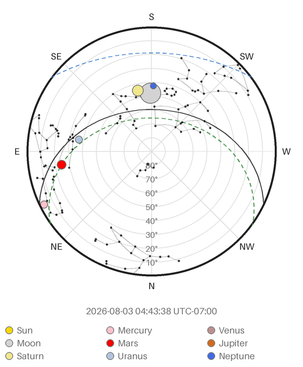
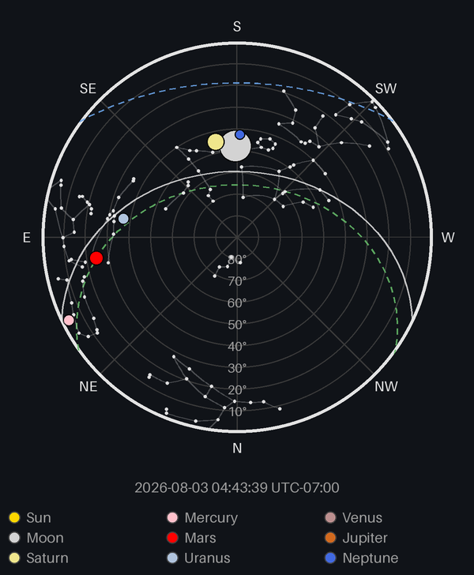

# Live Sun, Moon, and Planets

[](https://github.com/partofthething/ha_skyfield)

A live polar sun path chart for your location. Besides the Sun, it also shows the Moon and
a few major planets. Plus, it shows the Winter and Summer solstice sun paths and the
current path so you can see where you are in the seasons! It's a super interesting chart
because all at once it gives you an indication of the season, the time, and the sun
position, which, if you think about it, helps you orient yourself directionally just based
on observing the sun.

| | |
|---|---|
|  |  |

The card follows your light or dark theme.

This uses the [skyfield library](https://rhodesmill.org/skyfield/) to do the computations. 


See [`pebble/README.md`](pebble/README.md) for the watch and
[Standalone](#standalone) below for everything outside Home Assistant.

## To use with Home Assistant

* Install this in your `custom_components` folder (or add the repository to HACS)
  and restart
* Go to **Settings > Devices & Services > Add Integration** and search for
  *HA Skyfield*. The defaults are fine, and the location starts at your home
  location.
* Add this card to your dashboard:
```yaml
type: custom:skyfield-card
```

Optional card configuration:

* `title` a heading for the card
* `show_time` show a timestamp under the chart
* `show_legend` show a legend of the bodies
* `show_constellations` draw the constellations
* `north_up` (boolean) puts North at the top (useful in the Southern Hemisphere)
* `horizontal_flip` (boolean) flips projection horizontally
* `refresh_interval` seconds between asking the server for new positions (default 600)
* `redraw_interval` seconds between redraws (default 30)

Anything you leave out uses the integration's settings. Those can be changed any
time from the **Configure** button on the integration, and the chart redraws when
you save.

The solstice path colors can be changed with the `--skyfield-winter-color` and
`--skyfield-summer-color` theme variables.

The card registers itself as a dashboard resource, so normally there's nothing to
add by hand. It's drawn as SVG, so it stays sharp at any size and uses your theme
colors.

If your dashboard resources are managed in YAML, Home Assistant won't let the
integration add to them and you'll see a warning in the log. Add it yourself:

```yaml
lovelace:
  resources:
    - url: /ha_skyfield/skyfield-card.js
      type: module
```

If a dashboard reports `Custom element doesn't exist: skyfield-card`, check the
browser console for a `skyfield-card loaded` line. If it's missing, the file isn't
reaching the browser. If it's there, the dashboard asked for the card before it
loaded, and adding the resource above fixes it.

The chart is drawn in the browser from sky coordinates that Home Assistant sends.
Those change slowly, so the browser rotates the sky itself. It redraws every 30
seconds and only fetches new positions every ten minutes.

### Migrating from YAML configuration

An `ha_skyfield:` block in `configuration.yaml` still works. The first time Home
Assistant starts with this version, it's imported into a UI config entry with the
same settings. After that the block is ignored (with a warning in the log) and
can be deleted.

The options are the same in YAML and the UI:

* `show_constellations` enable or disable the constellations (default is True).
* `show_time` and `show_legend` defaults for the card
* `planet_list` customize which planets are shown
* `constellations_list` customize which constellations are shown (use names from
  [here](https://github.com/partofthething/ha_skyfield/blob/master/custom_components/ha_skyfield/constellations_by_RA_Dec.dat))
* `north_up` (boolean) puts North at the top (useful in the Southern Hemisphere)
* `horizontal_flip` (boolean) flips projection horizontally
* `latitude` and `longitude` if you want somewhere other than your home

## The old image version

For backwards compatibility there's still a camera entity if you'd rather have an
image:

```yaml
camera:
  platform: ha_skyfield
  show_constellations: false
```

Then add a picture entity to your dashboard with this camera. It's a standalone
YAML platform and doesn't need the integration, but you'll need the integration
for the card or the endpoints below. It takes the same options as above, plus:

* `image_type` `png` (default), `jpg`, or `svg`. JPEG compression smears thin
  lines, so stick with `png`.
* `theme` `light` (default) or `dark`. Unlike the card, an image can't follow
  your theme, so you have to pick one.
* `width` in pixels, 800 by default.

The integration also serves the chart at `/api/ha_skyfield/sky.png` and
`/api/ha_skyfield/sky.svg`. Both accept `?theme=`, and the PNG accepts `?width=`.
There's also a sensor platform whose state is the Sun's altitude. It writes the
chart to `www/sun.png`, available at `/local/sun.png`.

Use the card if you can. It updates in the browser, follows your theme, and stays
sharp at any size.

## Standalone

Outside of Home Assistant, this also includes:

* a **command line tool and small web server** that produce the same chart as an
  SVG file
* a **Pebble watch face**, in [`pebble/`](pebble/)


```console
$ pip install git+https://github.com/partofthething/ha_skyfield
$ skyfield-sky svg --lat 47.608 --lon -122.335 --tz America/Los_Angeles -o sky.svg
```

The first run downloads a 17 MB ephemeris to `~/.cache/ha_skyfield`, so only the
first run is slow. The SVG is a single file with no external CSS or fonts. It
follows the viewer's dark mode unless you set `--theme light` or `--theme dark`.
To match a site's colors, pass `palette` to `ha_skyfield.svg.render()` from Python.

For a website, the easiest option is usually to regenerate the file on a timer
and let your existing web server serve it:

```console
$ skyfield-sky watch --lat 47.608 --lon -122.335 --tz America/Los_Angeles \
      --interval 300 -o /var/www/sky.svg
```

Or run the built-in server, which needs no extra dependencies:

```console
$ skyfield-sky serve --lat 47.608 --lon -122.335 --tz America/Los_Angeles --port 8099
```

| | |
|---|---|
| `/` | a page showing the chart, auto-refreshing |
| `/sky.svg` | the chart |
| `/sky.png` | the chart as PNG, for things that don't support SVG |
| `/sky.json` | the sky data, same as what the card gets |
| `/sky.pebble` | compact binary data for the watch face |

Any option can be set in the query string, like `?lat=51.5&lon=-0.13&tz=Europe/London`,
`?theme=dark`, or `?constellations=Orion,UrsaMajor`, so one server can draw any
location. Unknown parameters return a 400 instead of silently drawing the wrong
place.

Use `--public` to run a server for other people:

```console
$ skyfield-sky serve --public --port 8099
```

In public mode the server has no default location, so `--lat` and `--lon` aren't
used, and a request without coordinates gets a 400 rather than your location.
Incoming coordinates are rounded to two decimals (about 1 km). That makes no
visible difference to the chart and keeps the cache small. See `examples/` for a
systemd unit and Apache vhost for hosting one.

`skyfield-sky png` writes a PNG instead. It needs Pillow, which is optional:

```console
$ pip install 'ha-skyfield[raster]'
$ skyfield-sky png --lat 47.608 --lon -122.335 --tz America/Los_Angeles \
      --width 1200 -o sky.png
```

`skyfield-sky json` and `skyfield-sky pebble` print the raw data if you want to
draw it yourself. `python -m ha_skyfield` works the same as `skyfield-sky`.

## Upgrading from 2.x

**matplotlib has been removed.** It was by far the heaviest dependency, and Home
Assistant installs everything in `requirements` on setup, so systems without a
prebuilt wheel had to compile it. Charts are now written directly as SVG or drawn
with Pillow, which Home Assistant already installs.

What changed:

* The camera still serves PNG by default and `image_type` still picks the format,
  so existing setups should keep working. It now also supports `svg`, plus new
  `theme` and `width` options.
* The sensor still writes `www/sun.png`, at a slightly different size.
* `Sky.plot_sky()` and the `plots` module are gone. Use `ha_skyfield.raster.render()`
  or `ha_skyfield.svg.render()` instead.
* Charts look a little different since they now match the card's layout and
  colors.

Known Issues:

* More (maybe) at [Issues](https://github.com/partofthething/ha_skyfield/issues)

Inspiration comes from the University of Oregon 
[Solar Radiation Monitoring Lab](http://solardat.uoregon.edu/PolarSunChartProgram.html).

## Developing

```console
$ uv venv && uv pip install -e .
$ cd custom_components && python -m unittest discover -s tests -t .
```

The chart is drawn in three languages: Python for files and the server,
JavaScript for the card, and C for the watch. On the Python side, `scene.py`
computes where everything goes and `styles.py` defines how it looks. `svg.py` and
`raster.py` both render from that, so the SVG and PNG output stay in sync.

The tests check that the three implementations agree:

* `test_projection.py` reads the card's layout constants from the JavaScript and
  compares them to the Python ones.
* `test_svg_matches_card.py` runs the card's `altAz` under `node` and checks it
  matches the Python.
* `test_watchface.py` compiles `pebble/src/c/projection.c` with `cc` and checks
  it lands within half a pixel of the Python.
* `test_watchface_parser.py` compiles the watch's payload parser and feeds it
  output from `ha_skyfield.pebble`.
* `test_raster.py` checks the PNG against the scene it came from: bodies land in
  the right spot and nothing inside the horizon is drawn outside it.
* `test_config_flow.py` checks that the UI form covers every option the YAML
  schema had, that every field is actually used, and that importing a YAML config
  preserves it exactly. The import only runs once on real settings, so it needs
  to be right.
* `test_platforms.py` builds the real Home Assistant entities and requests an
  image. `Camera.__init__` sets `self.content_type` as a plain attribute, so
  defining it as a property in a subclass breaks setup, and defining it as a
  class attribute gets silently overwritten. Neither shows up until the entity is
  actually constructed.

The cross-language tests skip if `node` or a C compiler is missing,
`test_raster.py` skips without Pillow, and `test_platforms.py` skips without
Home Assistant.
